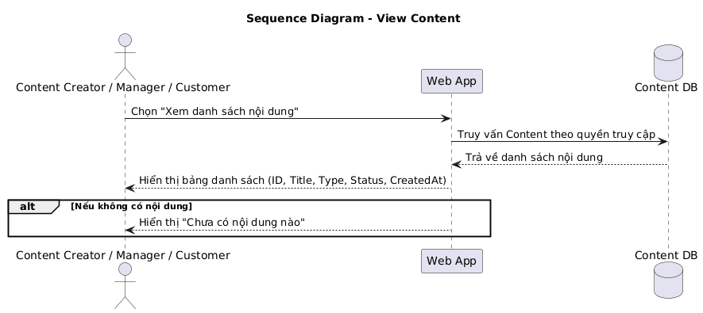

### Sequence UML  

**a) Luồng Thêm nội dung (Add Content)**  

**Giải thích:**  
- Actor **Content Creator** tương tác với **Web App**.  
- **Content DB** lưu nội dung mới.  
- **Manager/Editor** được thông báo nếu workflow duyệt nội dung bật.  

**b) Luồng Xem danh sách nội dung (View Content)**  
  

**Giải thích:**  
- Actor có thể là **Content Creator**, **Manager/Editor** hoặc **User/Customer**.  
- **Web App** truy vấn **Content DB** dựa trên quyền.  
- Nếu không có dữ liệu, hệ thống hiển thị thông báo “Chưa có nội dung nào”.  
---
