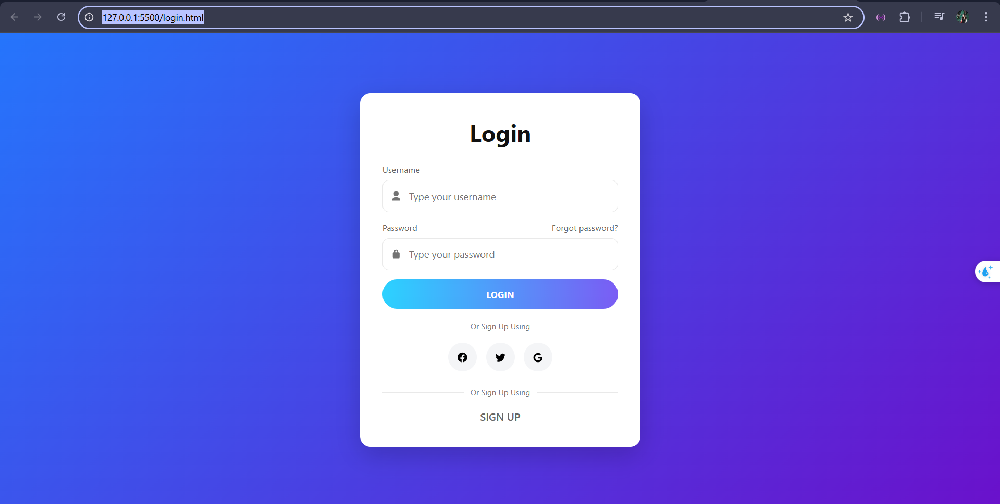

# 🚩 Lab 03 — Kiểm thử Form Đăng nhập (Selenium IDE)

**Môn:** Nhập Môn Công Nghệ Phần Mềm
**Nhóm:**

* Nguyễn Lê Vân Anh — N23DCPT004
* Vũ Hoàng Bảo Châu — N23DCPT008
* Huỳnh Mai Ánh Dương — N23DCPT014

---

## Mục tiêu

Thực hiện bộ test bằng **Selenium IDE** để kiểm chứng hoạt động của form đăng nhập (hai trường Username/Password, nút LOGIN, các link Forgot password? / SIGN UP và 3 nút đăng nhập social).

---

## Giao diện (tóm tắt)

Trang `login.html` bao gồm:

* Input **Username**
* Input **Password**
* Nút **LOGIN**
* Link **Forgot password?**
* Link **SIGN UP**
* Ba nút social: **Facebook, Twitter, Google**




---

## Test cases (tóm tắt)

1. **Login hợp lệ** — nhập tài khoản đúng → hiển thị thành công/đi tới Dashboard.
2. **Sai mật khẩu** — username đúng, password sai → show lỗi.
3. **Bỏ trống** — username hoặc password rỗng → show validation message.
4. **Forgot password** — link tồn tại và điều hướng đúng.
5. **SIGN UP** — link hiện ở vị trí thấp hơn form và click được.
6. **Social buttons** — có đủ 3 nút và phản hồi khi click (hoặc có attribute/ href).

---

## Tài khoản mẫu (dùng để test)

* Username: `sv_test@ptit.edu.vn`
* Password: `P@ssw0rd!`

*(Bạn có thể đổi thành account do nhóm tạo để tránh xung đột)*

---

## Hướng dẫn chạy (chi tiết từng bước)

### A. Chuẩn bị môi trường

1. Cài **VS Code** (nếu chưa có).
2. Cài extension **Live Server** trong VS Code.
3. Cài extension **Selenium IDE** cho Chrome hoặc Firefox.

### B. Mở trang test và lấy URL

1. Mở VS Code → `File > Open Folder...` → chọn thư mục project (chứa `login.html`).
2. Trên thanh Explorer, click phải vào `login.html` → `Open with Live Server`.
3. Trình duyệt sẽ mở trang, ví dụ: `http://127.0.0.1:5500/login.html` — **copy URL này**.

### C. Mở project test trong Selenium IDE

1. Mở extension **Selenium IDE** trên trình duyệt.
2. `File > Open Project` → chọn file `tests/login-tests.side` trong repo.
3. (Nếu file .side dùng đường dẫn tương đối) sửa step `open` trong mỗi test để thành URL copy từ Live Server.
4. Chạy `Run all tests` hoặc chạy từng test case.
5. Kiểm tra log để biết test pass / fail.

### D. Lưu ảnh chứng minh

* Sau khi chạy xong, chụp màn hình kết quả (Win: `Win+Shift+S`, macOS: `Cmd+Shift+4`).
* Lưu ảnh vào `tests/results/` rồi commit vào repo.

---

## Locators (gợi ý, ưu tiên ID > CSS)

* Username: `#username`
* Password: `#password`
* Login button: `button[type="submit"]` hoặc `#loginBtn`
* Forgot: `a.forgot-password` hoặc `xpath=//a[contains(.,'Forgot')]`
* Sign up: `a.signup`
* Facebook: `.social-facebook`
* Twitter: `.social-twitter`
* Google: `.social-google`

*(Nếu HTML khác, điều chỉnh selector tương ứng; ưu tiên dùng ID khi có.)*

---

## Ghi chú kỹ thuật & mẹo

* Nếu Selenium IDE không chạy tốt với `file://`, luôn dùng Live Server để phục vụ qua `http://`.
* Social login thường redirect ra provider — trong test chỉ cần verify **nút tồn tại** hoặc **href/data-provider**, không cần hoàn tất OAuth.
* Thêm `waitForElementPresent` trước các `click`/`assert` để tránh flaky tests.

---

## Xuất project và nộp bài

1. Trong Selenium IDE: `File > Save Project As` → chọn `tests/login-tests.side`.
2. Commit các file cần: `index.html`, `tests/login-tests.side`, `tests/results/*.png`, `README.md`.
3. Đẩy lên GitHub:

```bash
git add .
git commit -m "Lab03: Selenium IDE login tests"
git push origin main
```

4. Nộp link repo vào Google Classroom theo yêu cầu giảng viên.

---

## Checklist (xuống tay)

* [ ] Use Case diagram (đính kèm file hoặc ảnh)
* [ ] 6 test case đã implement và chạy được
* [ ] Locator rõ ràng, gọn (ưu tiên id/css)
* [ ] Ảnh screenshot kết quả (`tests/results/`)
* [ ] README hướng dẫn chạy (file này)
