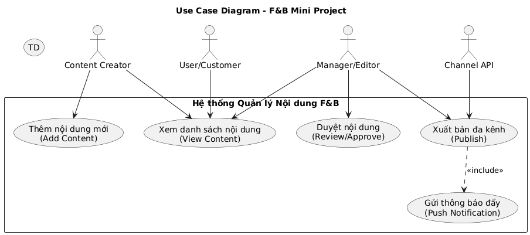
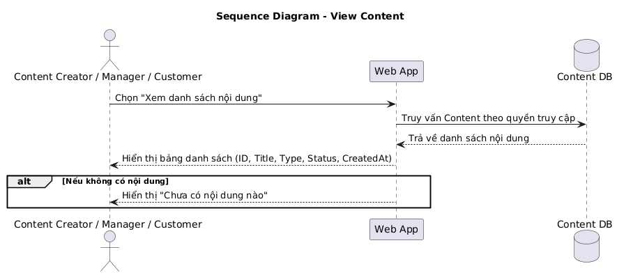

# 🧾 Lab 05 – Tích hợp, Quản lý & Báo cáo

## 🎯 Mục tiêu
Hoàn thiện quy trình phát triển phần mềm từ giai đoạn phân tích, thiết kế đến lập trình và triển khai.  
Sinh viên thực hành tổng hợp các artifacts (Use Case, Sequence, Form Login, báo cáo) vào một project hoàn chỉnh, và quản lý phiên bản qua GitHub.

---

## 💡 Đề tài mini project
**Web App Truyền thông đa phương tiện cho quán cà phê** 
Hệ thống cho phép **người tạo nội dung (Content Creator)** và **người quản lý (Manager)** quản lý, duyệt và xuất bản nội dung truyền thông đa kênh (Web, Facebook, TikTok, YouTube…).

### 🎯 Mục tiêu demo
- Quản lý nội dung số (poster, clip ngắn, bài viết).  
- Hai chức năng hoạt động được:
  - 📝 **Thêm nội dung mới (Add Content)**
  - 👀 **Xem danh sách nội dung (View Content)**
- Có form đăng nhập đơn giản (`login.html`).

---

## 🧩 Tổng hợp các artifact (Lab 01–04)

| **Lab** | **Nội dung** | **Kết quả / File** |
|----------|---------------|--------------------|
| **Lab 01** | Thiết lập môi trường, GitHub Repo, README | Repository cá nhân + mô tả nhóm |
| **Lab 02** | Phân tích yêu cầu, Use Case Diagram | ảnh `.png` |
| **Lab 03** | Sequence Diagram cho 2 chức năng chính | `seqadd.png`, `seqview.png` |
| **Lab 04** | Form đăng nhập (HTML/CSS/JS) | `login.html` |
| **Lab 05** | Báo cáo, gom artifacts, tạo version tag `v1.0` | `Lab05_Report.md` (file này) |


### Sơ đồ user case


### Sơ đồ sequence Add contetnt


### Sơ đồ sequence View contetnt


## 5. Source Code Giao Diện Đăng Nhập (Login Form)

📁 **Thư mục chứa mã nguồn**:  
🔗 [https://hmaianhduong-ctrl.github.io/App-quanly.github.io/](https://hmaianhduong-ctrl.github.io/App-quanly.github.io/)

### 💻 Clone về máy:
```bash
git clone https://github.com/EliseJulius/nhapmon-CNPM.git
cd Nhapmon-CNPM

## Triển khai demo bằng GitHub Pages

GitHub Pages được sử dụng để triển khai giao diện Login Form
Đường dẫn demo:
Link demo: https://hmaianhduong-ctrl.github.io/App-quanly.github.io/


