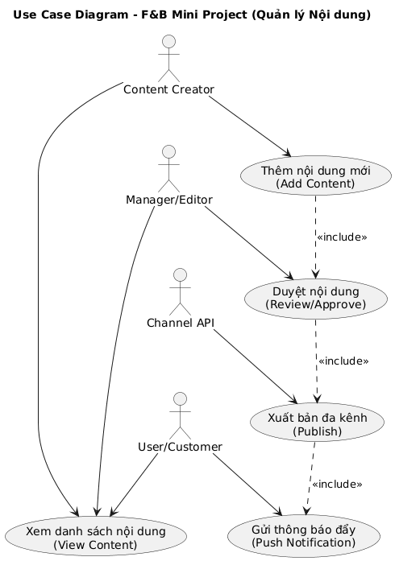
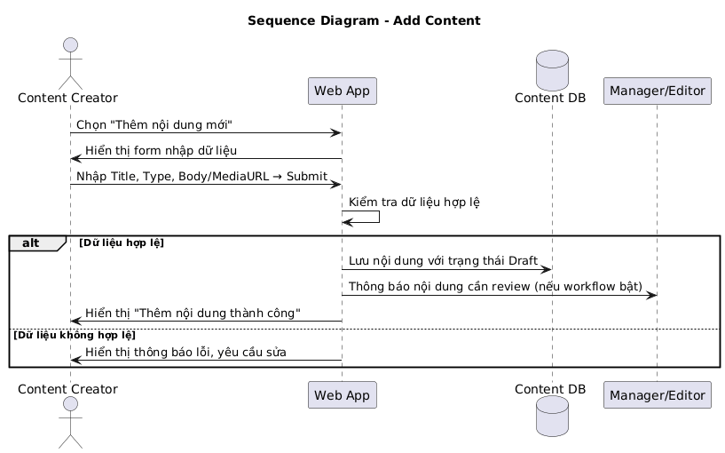

# 🛠️ Software Engineering Project – F&B (Nhà hàng & Cà Phê )

## 📌 Giới thiệu
Dự án này được phát triển trong môn **Nhập môn Công nghệ Phần mềm**.  
Mục tiêu là áp dụng quy trình phát triển phần mềm, từ **phân tích yêu cầu, thiết kế, lập trình, kiểm thử và triển khai**.  

## 👥 Thành viên nhóm
- Nguyễn Lê Vân Anh - N23DCPT004
- Vũ Hoàng Bảo Châu - N23DCPT008 
- Huỳnh Mai Ánh Dương - N23DCPT014

## 🎯 Use Case chính  
- Soạn nội dung (text, poster, video, clip)
- Quản lý nội dung (lịch, poster, kênh)
- Duyệt nội dung
- Xuất bản đa kênh
- Gửi thông báo đẩy
- SEO & Analytics
- Người dùng xem & tương tác (like/comment/share).


---

## 📐 Thiết kế hệ thống
- **Use Case Diagram**:
  


- **Sequence Diagram**:
  



- **ERD (Entity Relationship Diagram)**:

## 💻 Công nghệ sử dụng
- Ngôn ngữ: Java / Python / JavaScript / PHP
- IDE: Visual Studio Code
- CSDL: MySQL / PostgreSQL
- Quản lý phiên bản: Git + GitHub
- Mô hình phát triển: Agile – Scrum  

## 🚀 Cài đặt & chạy thử  
Clone repo:  
```bash
git clone https://github.com/hmaianhduong-ctrl/Nhapmon-CNPM.git
cd Nhapmon-CNPM

